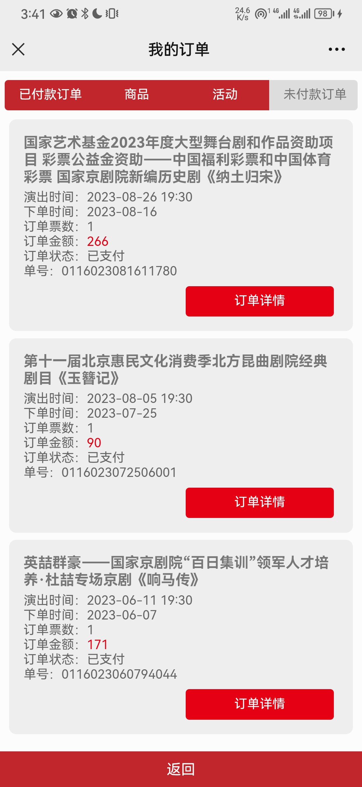

## 吉祥大戏院
位于银泰88七层,百年戏院,后拆除,由梅葆玖牵头,业内许多名家签字重建。我在这里看了三场戏，凤还巢由于和同学玩有冲突，我没去看。

## 梅兰芳大戏院
我在这里看过三出戏，包括最好的于魁智李胜素的纳土归宋

## 长安大戏院
我认为是这三个戏院中最好的西苑，位于长安街上，左边中国社科院，左前方中国海关总署，前方湖南大楼，右面北京国际饭庄，可以看得出这个规格规格有多么的高。包括CCTV-11空中剧院也都是在这里录的。我在这里看过三出戏，每一个的质量都很高，这个西苑在我的心目中具有深刻的位置。

[点击回到首页](../README.md)