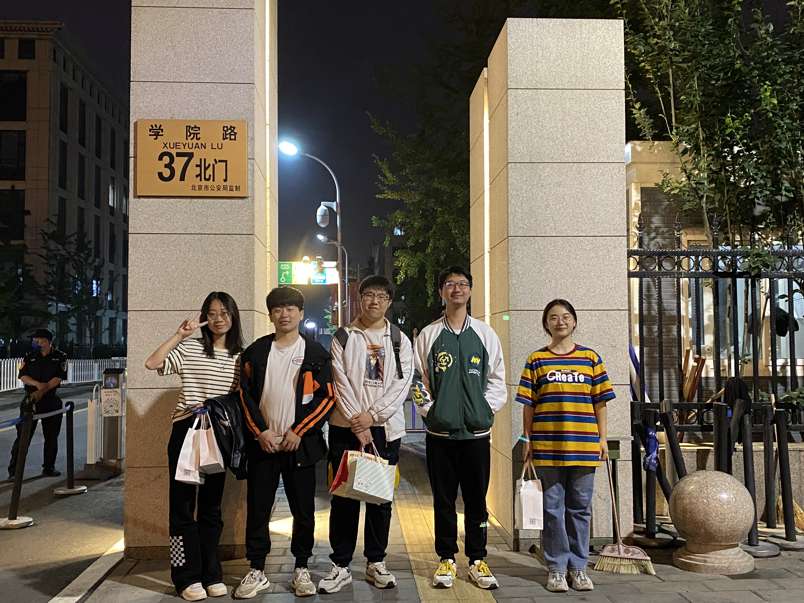
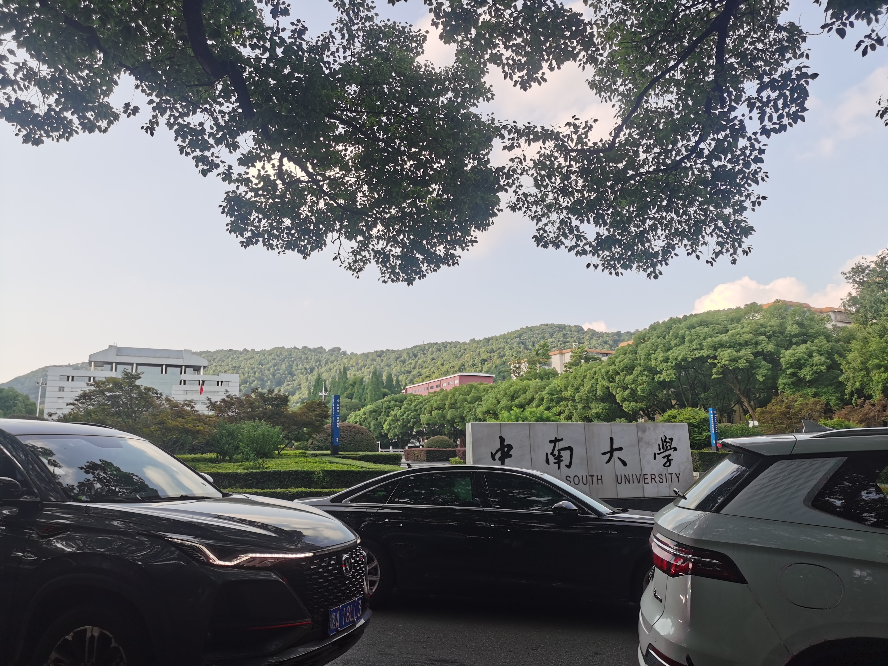
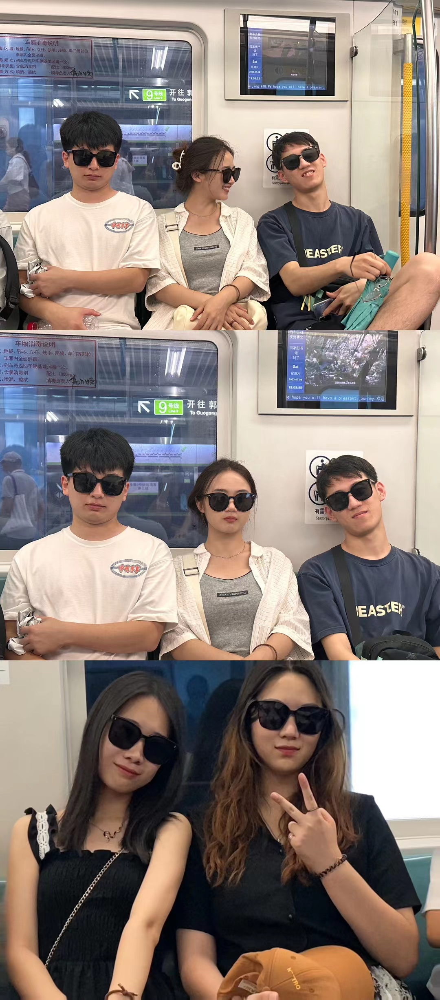
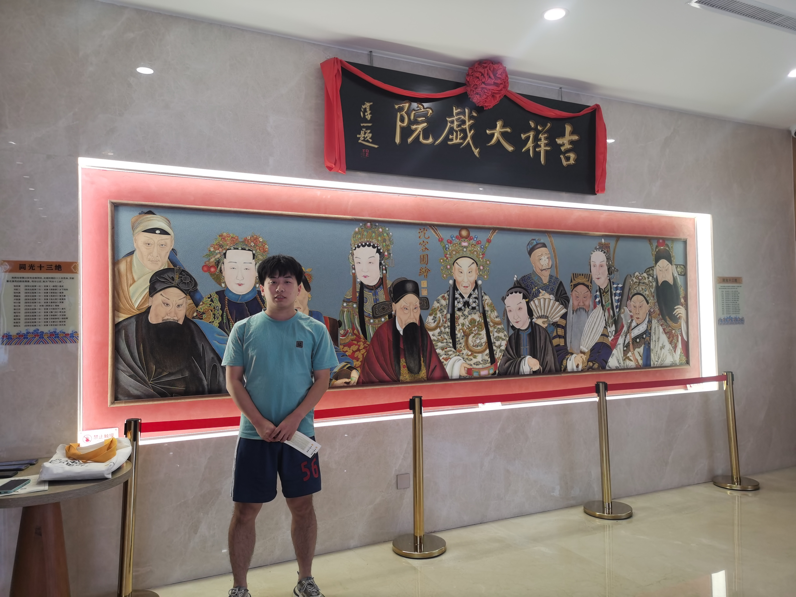

# 北京实习游玩记录

## 一、前言
　　我向来是不惮以最大的恶意揣摩长沙这座城市的，整个城市缺乏历史，缺乏文化，缺乏思想，充满了浮躁、网红气息、丧文化。当然作为一座两千年古都，长沙变成今天这个网红城市还要拜蒋光头所赐的文夕大火，但这不足以成为长沙社会风气的合理解释。那解放西半夜三四点夜不归宿的男男女女和附近天桥下流浪汉形成了鲜明对比；长沙的公交司机和私家车司机乃至其他司机开起车来可算是毫无素质可言；长沙的大学普遍呈现一种人浮于事，互相敷衍的状态……  
　　今年五月底，我接到了某家公司的实习offer，在北京，于是从五月二十九日到八月二十五日，我开始了北漂生活。北京作为中国的首都，承载了最多的政治、文化、历史的责任。于我来说北京是一座值得深爱的城市（虽然消费水平很高，这也是最致命的一个缺点）。我本人非常喜爱历史与传统文化，于是北京变成了我看也看不够，玩也玩不完的人间天堂。  
　　北京消费水平极高，我的住所在北京市顺义区乡下，房租很低，出门往西不远就是地铁站，往东不远有一个菜市场和小吃街，属于那种市民烟火气息浓厚的小镇，每每闲暇之余我变到小镇上购物一番，仔仔广场上看小孩玩闹、年轻人散步聊天、大爷下棋、大妈跳广场舞
、还有人直播唱歌，远离城市的快节奏与喧嚣，寻找一片祥和之地。然而我住的地方实在是太简陋了，而且孤身一人，短短的实习期间我也不想在物理添置一些东西，所以我不把这个地方叫做“家”，我和别人谈起时，只把他叫做“住的地方”，很难在这里找到归属感，以至于我在这个地方待不下去，周六周日比上班待的时间还短，导致老板让我交水电费我总是不在，我的电费到结束也没有用完。  
　　可曾记得，几乎每个周六日晚上去长安大戏院、梅兰芳大剧院、吉祥大戏院看戏，如果是周日晚上看戏，回去之后12点多，洗漱洗漱玩会儿手机就一点了，第二天起来上班，但我仍然感到充实。周六周日玩完我总会发个朋友圈（我之前从来不发朋友圈），每次的主要内容都是去看戏，夹杂着去别的地方游玩的图片，去别的地方游玩确实很多都是顺带的事情，北京的三大戏院吸引力太大了，总是是我恋恋不忘，因此有人在我的评论区总结：“**的朋友圈，听曲是第一位的”，哈，的确如此。  
　　可还记得，和同院同学王嘉耀天天一块上班，最有缘分的是有一次下班也偶遇了，比较有趣的一点是经常就因为我起床迟了，或是他起床迟了，然后就无奈变成了“错峰上班”。我在北京的生日也是和王嘉耀过的，我们吃了潮汕火锅，去了天安门，中山公园，在长安街上骑共享单车。  
　　可曾记得，正值我孤单的时候，我的高中同学魏嘉璐、周思衡来北京玩，还有在北京的同学张靖雅、贾怡芳，我们五个疯玩了两天，喝酒、动物园、海洋馆、逛北航北科、打扑克打到一点、溜冰，是我这三个月中最难忘的记忆。  
　　可曾记得，去天津和小叔看球、看海、游泳；和张绍乾在潮玩街区玩，吃饭的时候聊得情投意合，掏出手机就改签火车票，远赴他乡与有人会面的感觉总是美好而又令人怀念的。  
　　可曾记得，跟随部门到延庆区团建，大家吃烧烤，玩游戏，K歌，逗动物，踢一个瘪了气的足球，风景很美，人也很美，只是我往烧烤撒盐一不小心撒多了变成了苦的，还以后大家为什么不吃。  
　　可曾记得在我最拮据的时候，不是最，两次，不相上下。没钱回学校考试，借的钱回的学校；全身上下只剩不到二百块钱去什刹海、北海、看戏、长城，吃最便宜的饭，出行只靠公共交通（虽然因为错过五十分钟一趟的公交而忍痛打了一次车）。    
　　诸如此类的难忘时刻还有很多，刚入职同事把我这个零零后稀罕物件看、临近离职同组聚餐欢送我、从太谷回来给小使送太谷卷卷在地铁站干的蠢事、和表姐吃饭、刚来北京和赵大鹏、张靖雅、贾怡芳吃饭、逛学校。  
　　以下按时间顺序回顾记录我在北京实习期间的的游玩记录。  
## 二、 实习玩耍
### 230526出发去北京
　　出发前和舍友美美的吃了顿粤菜大餐，去橘子洲头逛了逛，很遗憾的是新冠阳了没有逛完。路上拍到模糊的汨罗河，山温水软，出发去北京。

[点击跳转出发去北京的详细记录](./230526%E5%87%BA%E5%8F%91%E5%8E%BB%E5%8C%97%E4%BA%AC/goBeijing.md)

### 230527高中同学小聚
我来北京的这天正好赵大鹏也来北京，于是由贾怡芳张靖雅做东欢迎我们两个一起吃了牛蛙，完了去二人学校北京航空航天大学、北京科技大学参观，只可惜我没有带身份证，没有进入北航。但是这个遗憾后来补上了。

[点击跳转高中同学小聚详细记录](./230527%E9%AB%98%E4%B8%AD%E5%90%8C%E5%AD%A6%E5%B0%8F%E8%81%9A/welcome.md)

### 230528和二姐吃饭逛恭亲王府
来北京和二姐玩,一起逛了恭亲王府，吃了火锅，恭亲王府真是私家园林的典范，庄重有没而不逾矩。送给了二姐一些湖南特产，二姐很开心哈哈。可惜的是只拍了一张照片。

### 230603长安大戏院看锁麟囊

嘿嘿，第一次在北京看戏，看的就是我最喜欢的程派戏锁麟囊，这出息也是我对程派的的入坑戏。主演为迟小秋亲传弟子沙霏。长安大戏院相当庄严气派，坐落在长安街，各种体验都是直接拉满。

[点击跳转长安大戏院详细记录](./230603%E9%95%BF%E5%AE%89%E5%A4%A7%E6%88%8F%E9%99%A2/ihan.md)

### 230611生日
在北京的生日是和王嘉耀一起过的,我们一起吃了潮汕牛肉火锅,自助的,吃了好多嘿嘿。然后去了天安门，看到了午门，只可惜没有抢到故宫的票，去了中山公园，去了天安门广场，骑着“同事”（美团共享单车）逛长安街，一直逛到国贸大厦,然后我去看戏。我俩在分开后坐地铁双双坐过站，也是让人忍俊不禁。第一次在梅兰芳大戏院看戏,杜喆《响马传》，好！

[点击跳转过生日详细记录](./230611%E7%94%9F%E6%97%A5/birthday.md)

### 230618十三陵
坐地铁两个半小时,终于到了十三陵,参观了定陵,这是十三陵唯一挖掘的一座,为明神宗万历陵寝。背靠山脊，风水上说的龙脉。陵中没有什么稀世珍宝，都被故宫和国博收藏了。万历的地宫倒是不错，39度的天我去底下凉快了两次。也到别的陵前走马观花看了一遍。

[点击跳转十三陵详细记录](./230618%E5%8D%81%E4%B8%89%E9%99%B5/uisjlk.md)

### 230622颐和园圆明园
这天晚上坐火车回长沙考试,于是我背着两台电脑就踏上了征途,觉得这一天就荒废了不甘心,就买了上午颐和园下午圆明园的票,【这一天40度的天】，过于离谱。感谢小使陪我在下午逛圆明园，和小使在一起玩总是有很多欢乐，说不完的话。然后晚上坐火车，主打的就是一个特种兵。

[点击跳转二园详细记录](./230622%E9%A2%90%E5%92%8C%E5%9B%AD%E5%9C%86%E6%98%8E%E5%9B%AD/yr.md)

### 230626回长沙
学校让我回去考试,考个试,只有三门考试,舟车劳顿,直接间接经济损失4000+RMB,反正学校这**东西是不好评价。不过也算是休息一下吧，还能趁此机会回老家一趟。

[点击跳转回长沙详细记录](./230626%E5%9B%9E%E9%95%BF%E6%B2%99/backSchool.md)

### 230629回老家
上午考完试,我连宿舍都不回直接去高铁站回老家,归心似箭,嘿嘿。在家吃了老家的kuoluo，油条老豆腐，烙饼，焖面，手擀面等等等等，虽然只回去满打满算三天，但是我还是很开心的，有亲戚邻居来看我，我也去看望长辈，家人高兴地不得了。

[点击跳转回老家的详细记录](./230629%E5%9B%9E%E5%AE%B6%E4%B9%A1/gohome.md)

### 230708高中同学
这两天是我这三个月内最开心的时刻,周思衡从廊坊来北京玩,魏嘉璐从太谷来北京,张靖雅也从实习的地方回北京,以及贾怡芳和我五个人在北京疯玩，和高中同学一起玩，可以无拘无束，可以不顾形象，可以畅所欲言，可以展现最真实的自己，不知道什么时候还能在这么玩一次，可能再也不能够了吧。周五我早早下班去和魏嘉璐贾怡芳喝酒，喝的我和小使回去的路上给人家吐；一起吃饭；去动物园海洋馆玩；走路回酒店在路上发疯；在酒店打扑克打到一点；一起去国贸溜冰；放弃了我早早买的一个京剧票一起玩，我安慰他们说是不是什么名角，也不是什么好戏；一起逛北科北航，这回带上身份证去北航了；晚上打麻将，在北京打太谷麻将；周日晚上回去的路上地铁那么漫长，总也不到头，突然在地铁上哭成了泪人……回到住的地方又是我孤身一人。

[点击跳转和高中朋友疯玩的详细记录](./230708%E9%AB%98%E4%B8%AD%E5%90%8C%E5%AD%A6/lltmtevsbk.md)

### 230714部门团建
部门团建,风景如画,同事间欢声笑语,是一次难得的经历,让我这个仅仅实习三个月的实习生赶上了。

[点击跳转团建的详细记录](/230714%E5%9B%A2%E5%BB%BA/trjm.md)

### 230715地坛加听曲
周六上午延庆回公司,回了公司我就去继续玩去了,先去地坛看了看,后去听戏了,主打的就是一个身体棒。第一次去吉祥大戏院看戏,自此北京戏曲三大剧院长安大戏院、梅兰芳大戏院、吉祥大戏院就都去过了，嘿嘿嘿。

[点击跳转地坛加听曲的详细记录](./230715%E5%9C%B0%E5%9D%9B%E5%8A%A0%E5%90%AC%E6%9B%B2/ritjandtkqu.md)

### 230722天坛大观园听曲
这应该是两天分开的活动,先看的戏。北昆在长安大戏院演出的救风尘，这是第一次现场听昆曲，昆曲绝对是最好的艺术，有思想，有厚度，有人民，有社会，有文化，有历史，有审美，有幽默，有高雅，有地气，在一场戏里就能体现的淋漓尽致。 
然后周日去了天坛以及大观园。领略皇家建筑以及我喜爱的红楼梦中的大观园，大观园中虽然小，但是在里面却总能想起红楼梦中的情景然后带入其中，久久不忍离去，难以忘怀。

[点击跳转天坛大观园听曲的详细记录](./230722%E5%A4%A9%E5%9D%9B%E5%A4%A7%E8%A7%82%E5%9B%AD%E5%90%AC%E6%9B%B2/tmtjdagryrtkqu.md)

### 230729天津
应小叔的邀请,我终于来天津玩了,小叔带我第一次看海,第一次游泳,第一次现场看球,虽然天津泰达打长春亚泰双方没能贡献进球,但是比赛还是精彩的,球场氛围也好,球场环境优美,能难忘的一次经历。第二天下大雨，和高中同学张绍乾在室内的一个潮玩街区完了一下午，吃了两顿饭，聊得甚是相投。我们两个抓娃娃十次抓了两个娃娃(准确的是九次)，每人各抓一个，作为456年龄最大的两位老人，在这个时候高兴地像个孩子。

